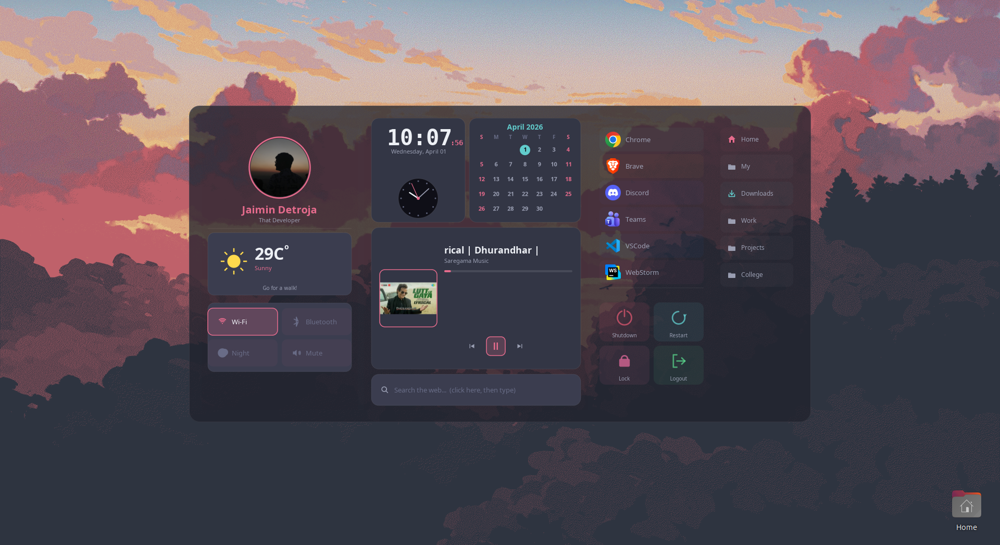

# my-widget
A glassmorphism desktop widget for Ubuntu — live clock, weather, music, app launcher, system controls, and file shortcuts, all in one always-on-desktop panel.



---

## Installation

### 1. Clone the repo
```bash
git clone https://github.com/JaiminPatel345/my-widget.git
cd my-widget
```

### 2. Install dependencies
```bash
bash install.sh
```
This installs all required system packages (GTK3, Cairo, playerctl, redshift, etc.) and optionally sets up autostart.

### 3. Configure
Edit `config.json` to personalise the widget:
```json
{
  "display_name": "Your Name",
  "subtitle":     "Your Title",
  "profile_image": "~/Pictures/profile.jpg",
  "city": "YourCity",

  "apps": [
    { "name": "Chrome", "icon": "google-chrome", "cmd": "google-chrome", ... }
  ],

  "files": [
    { "label": "Home",      "path": "~",           "icon": "home"   },
    { "label": "Downloads", "path": "~/Downloads",  "icon": "downloads" }
  ]
}
```

Place your profile photo at `~/Pictures/profile.jpg` (or update the path in `config.json`).

### 4. Run
```bash
python3 widget.py
```

### 5. Auto-start on login (optional)
```bash
bash autostart.sh
```
The widget will launch automatically every time you log in.

---

## Blur effect (optional)
For a frosted-glass background, install and configure **picom**:
```bash
sudo apt install picom
```
Add to `~/.config/picom.conf`:
```ini
blur-method = "dual_kawase";
blur-strength = 8;
blur-background = true;
```
Then start picom:
```bash
picom --daemon
```

---

## What's inside

| Panel | Contents |
|-------|----------|
| Left | Profile photo, live weather, system toggles (Wi-Fi, Bluetooth, Night mode, Mute) |
| Center | Clock + analog hand, calendar, music player with thumbnail, search bar |
| Right | App launcher, system actions (Shutdown, Restart, Lock, Logout) |
| Files | Quick-access directory shortcuts |

---

## Dependencies
- Python 3
- PyGObject — GTK3, Gdk, Pango, PangoCairo, GdkPixbuf
- pycairo
- `playerctl` — music metadata
- `redshift` — night mode
- `nmcli` — Wi-Fi toggle
- `bluetoothctl` — Bluetooth toggle
- `pactl` — audio mute
- `requests` (optional) — live weather from wttr.in
